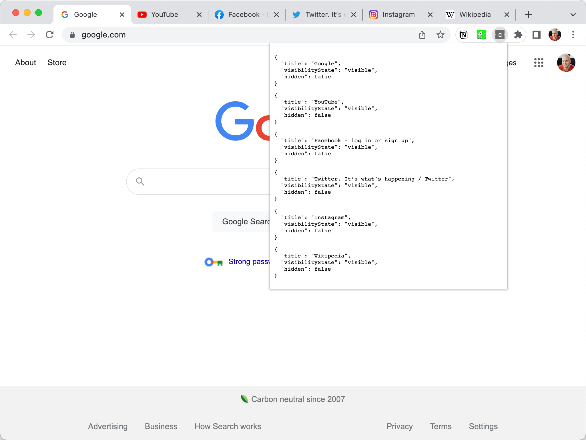

# README

The extension opens tabs on install.

Open the popup after install. You should see this:



## Expected:

Every tab expect for the active one should show:

```
{
  "title": ...,
  "visibilityState": "hidden",
  "hidden": true
}
```
